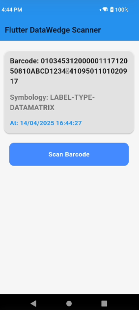

# flutterdatawedge
Flutter DataWedge Using Zebra Handheld Device

DataWedge is a powerful service provided by Zebra Technologies that enables barcode scanning and data capture on Zebra Android devices without the need for complex SDK development. Designed to work seamlessly in enterprise environments, DataWedge simplifies the process of integrating scanning functionality into Android and Flutter applications.

The Flutter integration utilizes platform channels to communicate with DataWedge, allowing the app to send configuration commands and receive real-time scanned data via broadcast intents. This setup provides a responsive and efficient user experience, making it ideal for retail, warehousing, healthcare, and logistics scenarios.

The UI within Flutter apps can be tailored to display scanned information—such as barcode values, symbologies, and timestamps—in a clean and user-friendly layout. Combined with Zebra’s enterprise-grade hardware, the integration ensures fast, accurate, and reliable data capture while maintaining a modern mobile interface.

Key Highlights:
No SDK required – easy to configure using intent-based communication

Real-time scan data delivery directly into the Flutter layer

Customizable scan profiles for different use cases

Lightweight and responsive integration for production apps

Whether used in inventory management, loyalty systems, or access control, DataWedge streamlines scanning workflows with minimal development effort while offering robust performance.

App Screenshot

